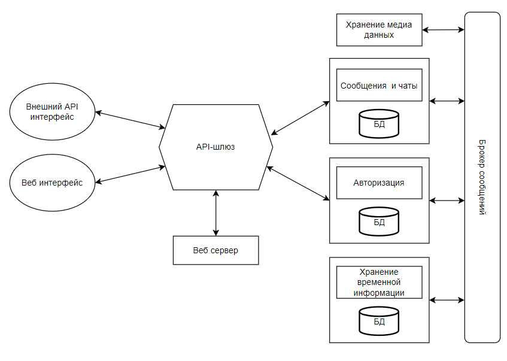
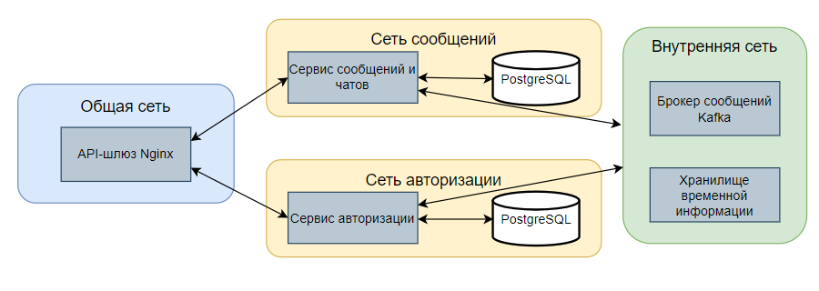
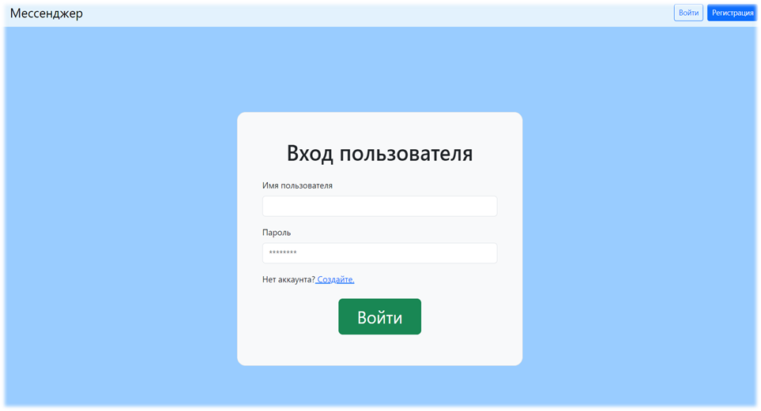
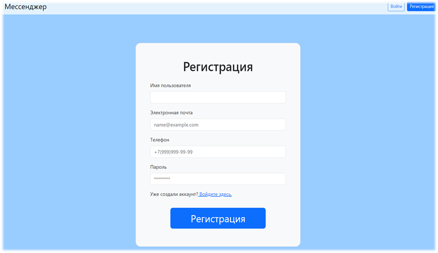
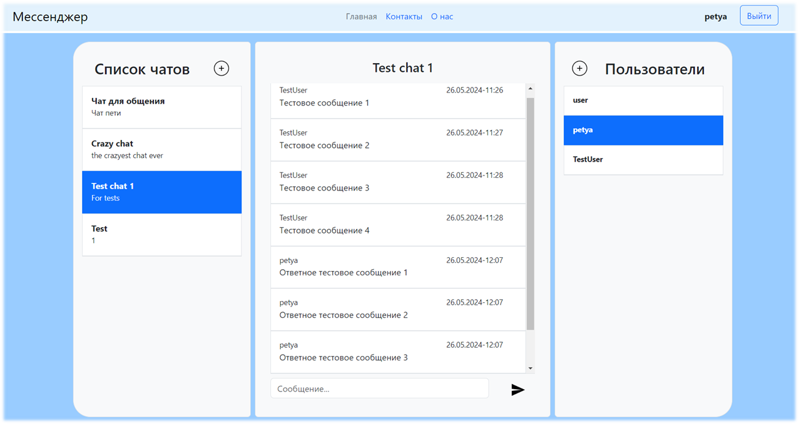

#  Messenger
## Разработанное приложение является мессенджером микро сервисной архитектуры.

### Сервисы
- Веб сервер - для работы с браузерами пользователей. Работает на JavaScript React и сервере Node;
 API-шлюз - точка входа в приложение, обрабатывающая и перенаправляющая все входящие запросы. Работает на Nginx сервере;
- Авторизация - сервис отвечающий за регистрацию, вход и авторизацию пользователей. Работает на Java Spring Framework, база данных Postgres;
- Сообщения и чаты - сервис отвечает за основную функцию чата, работа с сообщениями, чатами и списком контаков пользователя. Работает на Java Spring Framework и базе данных Postgres;
- Хранение медиа данных - сервис отвечает за хранение и обработьку медиа данных пользователей. не реализован;
- Хранение временной информации - отвечает за созранение невалидных (отозванных токенов) JWT токенов. База данных Redis;
- Брокер сообщений отвечает за взаимодействие сервисов между собой и хранения самих сообщений. Реализован с помощью Kafka.
### Docker
Для запуска и работы приложений как единого целого используется технология контейнеризации. Она позволяет изолировать сервисы друг от друга и внешней сети.

### Интерфейс приложения

Возможности:
- создание чатов;
- добавление пользолвателей в чат;
- добавление пользователей в контакты;
- добавление новых сообщений.
